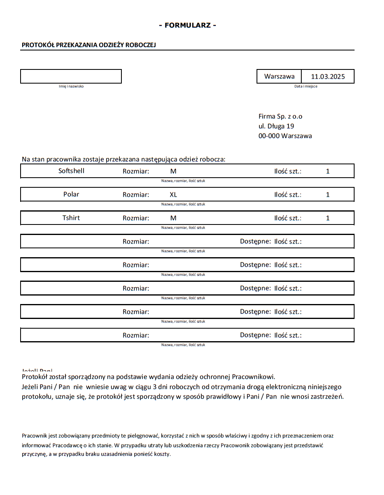
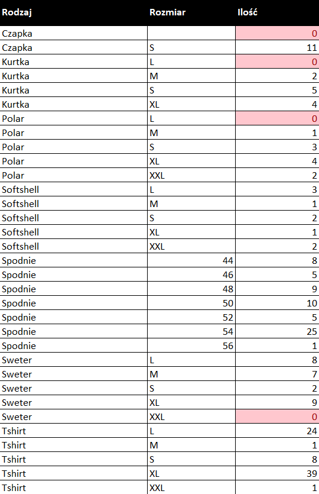
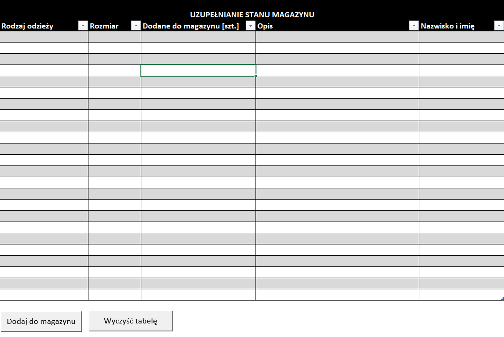

# Magazyn Ubrań – Excel Automation

## Opis projektu

Jest to skoroszyt Excel automatyzujący proces zarządzania magazynem ubrań roboczych w firmie. Arkusz pozwala na szybkie rejestrowanie wydanych ubrań oraz aktualizowanie stanów magazynowych za pomocą formularza i makr VBA.

## Struktura pliku
Plik zawiera 3 arkusze:
### 1. Formularz
- Arkusz służy do rejestrowania wydawania ubrań pracownikom.
- Na podstawie formularza generowany jest gotowy dokument do podpisania przez pracownika.
- Dane są zapisywane w arkuszu Dane po naciśnięciu przycisku (uruchamiającego makro VBA).
- Formularz dodatkowo jest zabezpieczony walidacją danych aby można było wybrać tylko przedmioty dostępne w magazynie.
- Formatowanie warunkowe wskazuje komórki, które należy jeszcze wypełnić.




### 2. Raport
- Pierwsza tabela Wyświetla aktualny stan magazynu w formie dynamicznej tabeli.
- Dane są filtrowane i sortowane za pomocą funkcji pozostawiając jedynie unikalne rodzaje przedmiotów:

    ```=SORT(UNIQUE(FILTER(HSTACK(TKartoteka[Rodzaj]; IF(TKartoteka[Rozmiar]=""; ""; TKartoteka[Rozmiar])); TKartoteka[Rodzaj]<>"")); {1\2}; {1\1}; FALSE)```

- Dzięki tej funkcji dodawanie nowych rodzajów oraz rozmiarów do magazynu nie wymaga edycji kodu 



- Druga tabela pozwala na uzupełnianie stanu magazynu – magazynier może dodać nowe pozycje.
- Dane są zapisywane do arkusza Dane przy pomocy makra VBA.




### 3. Dane
- Przechowuje historię wszystkich operacji: wydanych ubrań oraz aktualizacji magazynu.
- Dane są automatycznie dodawane przez makra z arkuszy Formularz i Raport.
- Rozwiązanie przeznaczone do małych magazynów, przy większej ilości lepszym rozwiązaniem może być baza danych

### 4. Kod VBA

### Usuwanie przedmiotów z magazynu (VBA)
Opis działania

To makro odpowiada za rejestrowanie wydanych ubrań w arkuszu Dane. Po wypełnieniu formularza i kliknięciu przycisku:
1. Pobiera dane z formularza, w tym rodzaj ubrania, rozmiar, ilość oraz opis.
2. Pobiera imię i nazwisko pracownika na podstawie pola A8 w arkuszu Formularz.
3. Znajduje ostatni wiersz w tabeli TKartoteka i dodaje nowe wpisy.
4. Generuje unikalny identyfikator (ID) dla każdego wpisu.
5. Rejestruje datę, lokalizację oraz firmę.
6. Po zakończeniu operacji wyświetla komunikat i przełącza widoczność przycisków w arkuszu.

```
Sub Usuniecie_z_magazynu()

    Dim Rodzaj(8), Rozmiar(8), Ilosc(8), Opis(8) As String
    Dim Zakres As Range
    Dim imie, Nazwisko As String
    Dim dateSeparator As String
    
    dateSeparator = Application.International(xlDateSeparator)
     
    Set Zakres = Range("A21:J35")
    
    Sheets("Formularz").Select
    Range("A21").Select
    
    ' Pobieranie danych z arkusza
    indeks = InStr(1, Range("A8").Value, " ")
    If indeks = 0 Then
        MsgBox "Brak spacji w imieniu i nazwisku. Wprowadź poprawne dane."
        Exit Sub
    End If
    
    imie = Left(Range("A8").Value, indeks - 1)
    Nazwisko = Mid(Range("A8").Value, indeks + 1)
        
    For i = 1 To 8 Step 1
        If Zakres(2 * i - 1, 1).Value <> "" Then
            Zakres(2 * i - 1, 1).Select
            Rodzaj(i) = ActiveCell.Value
                  
            ActiveCell.Offset(0, 2).Select
            Rozmiar(i) = ActiveCell.Value
                        
            ActiveCell.Offset(0, 5).Select
            Ilosc(i) = ActiveCell.Value
            
            If IsEmpty(Ilosc(i)) = True Then
                MsgBox ("Nie wybrano ilości sztuk, popraw wprowadzone dane.")
                Exit Sub
            End If
            
            ActiveCell.Offset(0, 1).Select
            Opis(i) = ActiveCell.Value
        End If
    Next i

    ' Ustaw arkusz z danymi
    Set wsDane = Sheets("Dane")
    
    ' Ustaw tabelę
    Set tbl = wsDane.ListObjects("TKartoteka")

    ' Znajdź ostatnie ID w tabeli
    If tbl.ListRows.Count > 0 Then
        previousID = Application.WorksheetFunction.Max(tbl.ListColumns(1).DataBodyRange)
    Else
        previousID = 0
    End If
    
    ' Dodanie nowych wpisów do tabeli
    For i = 1 To 8 Step 1
        If Rodzaj(i) = "" Then GoTo NextIteration

        Set pustyWiersz = tbl.ListRows.Add
        
        ' Wypełnienie nowego wiersza
        With pustyWiersz.Range
            .Cells(1, 1).Value = previousID + 1
            .Cells(1, 2).Value = Nazwisko & " " & imie
            .Cells(1, 3).Value = Format(Worksheets("Formularz").Range("J8").Value, "dd" & dateSeparator & "mmm" & dateSeparator & "yyyy")
            .Cells(1, 4).Value = "Warszawa"
            .Cells(1, 5).Value = "Oddział"
            .Cells(1, 6).Value = Rodzaj(i)
            .Cells(1, 7).Value = Rozmiar(i)
            .Cells(1, 8).Value = Ilosc(i)
            .Cells(1, 11).Value = Opis(i)
        End With
        
NextIteration:
    Next i

    Sheets("Formularz").Select
    MsgBox ("Przedmioty usunięte z magazynu.")

    ' Zmiana widoczności przycisków
    ActiveSheet.Shapes("Krok2").Visible = False
    ActiveSheet.Shapes("Krok4").Visible = True

End Sub
```

### Uzupełnianie magazynu (VBA)
Opis działania

Makro Uzupelnienie_magazynu automatyzuje dodawanie nowych ubrań do magazynu. Jego funkcjonalność obejmuje:

1. Pobieranie danych o nowych przedmiotach wprowadzonych przez magazyniera.

2. Przypisanie nowych wpisów do tabeli w arkuszu Dane.

3. Obsługę ewentualnych błędów w danych.

```
Sub Uzupelnienie_magazynu()
'
    Dim NazwaArkusza(24) As String
    Dim Rodzaj(24), Rozmiar(24), Ilosc(24), Opis(24), Nazwisko(24), DataZwrotu(24) As String
    Dim Zakres As Range
    Dim dateSeparator As String
    
    dateSeparator = Application.International(xlDateSeparator)
 
    Set Zakres = Range("J3:M26")
    
    Sheets("Raport").Select
    Range("J3").Select
    
    miejsce = Range("R1").Value
    firma = Range("R2").Value
    
    For i = 1 To 24 Step 1

        If Zakres(i, 1).Value <> "" Then
            Zakres(i, 1).Select
                
            Rodzaj(i) = ActiveCell.Value
            ActiveCell.Offset(0, 1).Select
            Rozmiar(i) = ActiveCell.Value
            ActiveCell.Offset(0, 1).Select
            Ilosc(i) = ActiveCell.Value
            ActiveCell.Offset(0, 1).Select
            Opis(i) = ActiveCell.Value
            ActiveCell.Offset(0, 1).Select
            Nazwisko(i) = ActiveCell.Value
        End If
    Next i
    
    ' Ustaw arkusz, w którym znajduje się tabela
    Set wsDane = Sheets("dane")
    
    ' Ustaw tabelę
    Set tbl = wsDane.ListObjects("TKartoteka")
        
    ' Sprawdź, czy tabela nie jest pusta
    If tbl.ListRows.Count > 0 Then
        ' Znajdź maksymalną wartość w pierwszej kolumnie (ID)
        previousID = Application.WorksheetFunction.Max(tbl.ListColumns(1).DataBodyRange)
    Else
        ' Jeśli tabela jest pusta, ustaw previousID na 0
        previousID = 0
    End If
    
    For i = 1 To 8 Step 1
        If Rodzaj(i) = "" Then GoTo NextIteration

            Set pustyWiersz = tbl.ListRows.Add
            
            ' Wypełnij nowy wiersz danymi
            With pustyWiersz.Range
                .Cells(1, 1).Value = previousID + 1
                .Cells(1, 2).Value = Nazwisko(i)
                .Cells(1, 3).Value = Format(Date, "dd" & dateSeparator & "mmm" & dateSeparator & "yyyy")
                .Cells(1, 4).Value = miejsce
                .Cells(1, 5).Value = firma
                .Cells(1, 6).Value = Rodzaj(i)
                .Cells(1, 7).Value = Rozmiar(i)
                .Cells(1, 10).Value = Ilosc(i)
                .Cells(1, 11).Value = Opis(i)
            End With
      
NextIteration:
    Next i

    Sheets("Raport").Select
    MsgBox ("Przedmioty dodane do magazynu.")
End Sub
```


## Technologie użyte w projekcie

- **Excel:** – dynamiczne formuły, tabele
- **VBA:** – makra zapisujące dane do arkusza Dane
- **Automatyzacja:** – minimalizacja ręcznego wprowadzania danych

## Screenshoty


## Jak używać?

Wypełnij arkusz Formularz, aby dodać wpis do magazynu.
Kliknij przycisk, aby zapisać dane.
Sprawdź stan magazynowy w arkuszu Raport.
Wprowadź nowe dostawy w tabeli i kliknij przycisk, aby dodać je do bazy.

## Podsumowanie
Projekt ten został stworzony jako część optymalizacji procesów w pracy i jest przykładem automatyzacji zarządzania magazynem w Excelu przy użyciu VBA.

